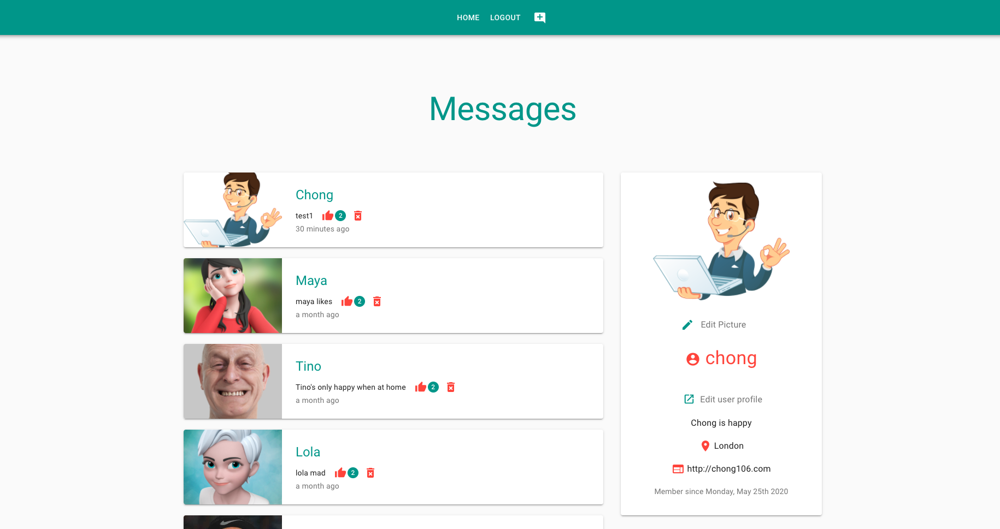
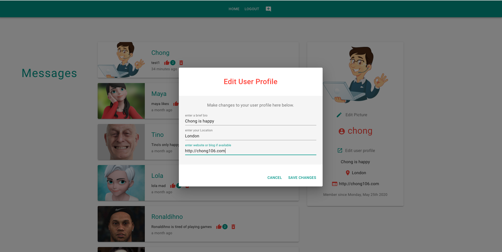
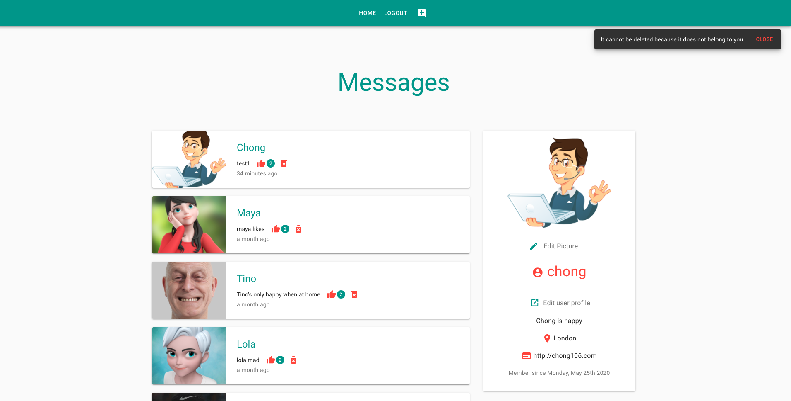

# chat-app-client-rfb.
### live to create an account/login/post/like /delete.  &nbsp; :mega: &nbsp; :loudspeaker: &nbsp; :tada:
### live @ => https://donpio.tech/repositories/chatapp/

react º redux º material-ui º firebase º node º express.            
ref=> project:google.cloud.functions./chat-app-5c91e

- __chat-app__ repo - (gc functions-backend)
- Or run concurrently by proxy [server/client]
- React/Redux application and Google Cloud Functions w/Firestore/FireStorage DB, Material-UI...and little bit of GSAP

  

### completed
- user login - logout - signup w/ validation √
- show userProfile √
- user profile image upload √ 
- edit userProfile √
- user like/likeCount √
- warning badges for likes √ [when authenticated : not authenticated :already liked before] √
- footer comp - √
- add message √ [it's ok to like your own message - but just once && while authenticated]
- delete messages √ [so long as you own it and authenticated] √
- warning badges for messages √ [ when message does not belong to user] √
- grid √ [messages: 12 - col not authenticated] [messages: 8col when authenticated] √
- heading √ [moves to the side of messages when scroll-down - react.ref] √
- updated backend firebase function - chat-app-repo (returns user info + messages - not protected) √
- installed gsap & updted styling √
- login/signup loading component √
- nav link button to user profile √
- added account button for logged in user while authenticated. √
- updated ui site link √
- user ui page...

> a few changes coming..        

      
other:             

º [todo] => if user uploads profile image and has already posted a message with default image, it should update posted message image as well. 
ª loading   
º refactoring /classes etc.     
º responsiveness.    √ 

> ___screenshots__ @: [/images/screenshots/]

<kbd>screenshot..messages/userProfile</kbd> 
 

<kbd>screenshot..editProfile</kbd> 
 

<kbd>screenshot..deleteWarningBadge</kbd> 
 

