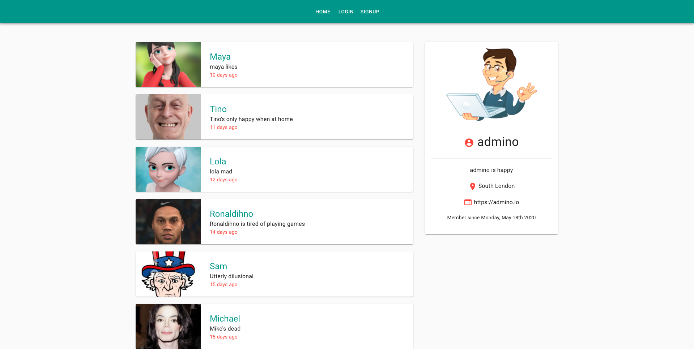

# chat-app-client-rfb
react º redux º material-ui º firebase º node º express.            
ref=> project:google.cloud.functions./chat-app-5c91e

- __chat-app__ repo - (gc functions-backend)
- Or run concurrently by proxy [server/client]
- React/Redux application with Firebase Firestore && FB Storage DB, Material-UI.

  

### completed
- user login - logout - signup w/ validation √
- show userProfile √
- user profile image upload √ 
- edit userProfile √
- user like/likeCount √
- warning badges √
- footer comp - √
- add message √ [it's ok to like your own message - but just once && while authenticated]
- delete messages ui ..

> a few changes coming..

note: could also use warning badge for:
- currently used for likes only (not authenticated warning && already liked warning)
- delete button
  + message does not exist or 
  + message does not belong to user
- add button
  + message had been added

<kbd>screenshot..</kbd> 
 

